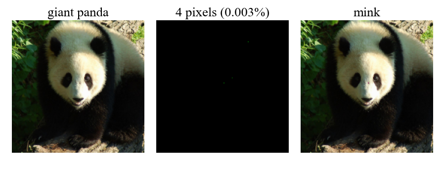
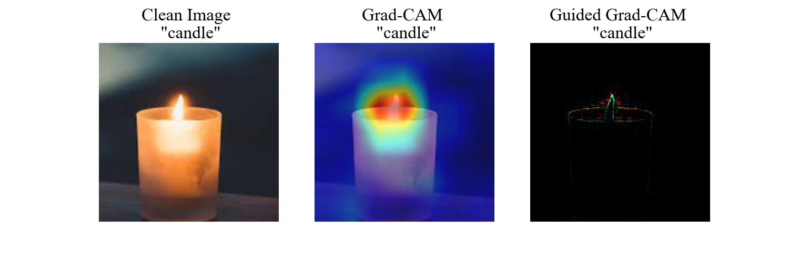
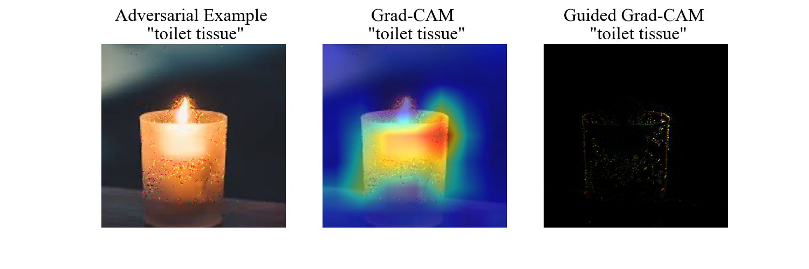

# Towards Interpretable Adversarial Examples via Sparse Adversarial Attack

Sparse attacks are to optimize the magnitude of adversarial perturbations for fooling convolutional neural networks (CNNs) involving only a few perturbed pixels (i.e., under the l0 constraint), suitable for interpreting the vulnerability of CNNs. However, existing solutions fail to yield interpretable adversarial examples due to their poor sparsity. Worse still, they often struggle with heavy computational overhead, poor transferability, and weak attack strength. In this paper, we aim to develop a sparse attack for understanding the vulnerability of CNNs by minimizing the magnitude of initial perturbations under the l0 constraint, to overcome the existing drawbacks while achieving a fast, transferable, and strong attack to CNNs. In particular, a novel and theoretical sound parameterization technique is introduced to approximate the NP-hard l0 optimization problem, making directly optimizing sparse perturbations computationally feasible. Besides, a novel loss function is designed to augment initial perturbations by maximizing the adversary property and minimizing the number of perturbed pixels simultaneously. Extensive experiments are conducted to demonstrate that our approach, with theoretical performance guarantees, outperforms state-of-the-art sparse attacks in terms of computational overhead, transferability, and attack strength, expecting to serve as a benchmark for evaluating the robustness of CNNs. In addition, theoretical and empirical results validate that our approach yields sparser adversarial examples, empowering us to discover two categories of noises, i.e., “obscuring noise” and “leading noise”, which will help interpret how adversarial perturbation misleads the classifiers into incorrect predictions. 


# Requirement

Our algorithm is based on the following libraries:

- torch
- torchvision
- matplotlib
- tqdm
- Pillow
- numpy
- grad-cam

You could use the following instruction to install all the requirements:

```python
# install requirements
pip install -r requirements.txt
```


## Evaluation on Sparsity

### Run

To evaluate the sparsity, please first move to  `src` directory, and then directly run `main.py`.

```python
# move to src
cd src

# run
python main.py
```

### Result

The following figure illustrates an example of our sparse attack, where our approach misleads the classifier to predict "mink" on the "giant panda" with only 4 perturbed pixels.




## Interpret the Adversarial Perturbation

### Run

To exhibit two types of noise, please first move to  `src` directory, and then directly run `viz_noise.py`.

```python
# move to src
cd src

# run
python viz_noise.py
```


### Result

- Grad-CAM and Guided Grad-CAM visualizations on a clean image of "candle"



- Grad-CAM and Guided Grad-CAM visualizations on an adversarial example of "toilet tissue"



